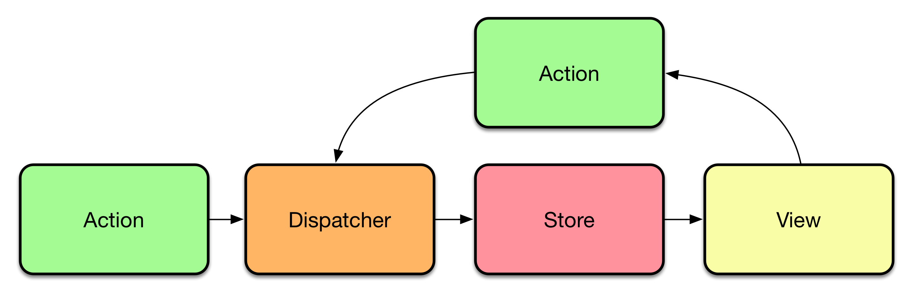

class: center, middle
background-color: #0A6C8A

# .white-title[Asynchronous Universal Component Rendering]

&nbsp;

## .white-title[Beyond Flux/Redux/Relay for component data requirement definitions and fetching]

---

class: right

&nbsp;

# $ whoami

&nbsp;

&nbsp;

## Jacob Bass

## bassjacob@gmail.com

## github.com/subshad

## http://jacobbass.net

---

class: center, middle, inverse

# Why React?

---

class: center, middle, image-background
background-image: linear-gradient(rgba(0,0,0,0.55),rgba(0,0,0,0.55)), url('public/components.jpg')

# .white-title[Components]

---

class: center, middle, image-background
background-image: linear-gradient(rgba(0,0,0,0.55),rgba(0,0,0,0.55)), url('public/predictability.jpg')

# .white-title[Predictability]

---

class: center, middle, image-background
background-image: linear-gradient(rgba(0,0,0,0.55),rgba(0,0,0,0.55)), url('public/modularity.jpg')

# .white-title[Modularity]
## .white-title[&]
# .white-title[Composability]

---

class: center, middle, image-background
background-image: linear-gradient(rgba(0,0,0,0.55),rgba(0,0,0,0.55)), url('public/community.jpg')

# .white-title[Community]

---

class: center, middle
background-color: #4FAA33

# .white-title[But something is wrong...]

---

class: center, middle
background-color: #22334F

# .white-title[Flux in 5 Minutes]

---

class: center, middle



---

class: center, middle


---

class: center, middle
background-color: #33114F

# .white-title[Q: Can We Do Better?]

---

class: center, middle
background-color: #11774F

# .white-title[Co-located Data Requirements]

## .white-title[&]

# .white-title[Universal Rendering]

---

```javascript
import { Component } from 'react';

@data(({greetingId, targetId}) => {
  //do some magic and return { greeting, target }
});
export default class HelloWorld extends Component {
  render() {
    const { greeting, target } = this.props;

    return (
      <div>{greeting} to {target}</div>
    )
  }
}
```

---

class: center, middle
background-color: #33AA4F

# .white-title[[facebook/relay](https://github.com/facebook/relay)]

---

```javascript
class Tea extends React.Component {
  render() {
    var {name, steepingTime} = this.props.tea;
    return (
      <li key={name}>
        {name} (<em>{steepingTime} min</em>)
      </li>
    );
  }
}

Tea = Relay.createContainer(Tea, {
  fragments: {
    tea: () => Relay.QL`
      fragment on Tea {
        name,
        steepingTime,
      }
    `,
  },
});
```

---

```
class TeaStore extends React.Component {
  render() {
    return <ul>
      {this.props.store.teas.map(
        tea => <Tea tea={tea} />
      )}
    </ul>;
  }
}

TeaStore = Relay.createContainer(TeaStore, {
  fragments: {
    store: () => Relay.QL`
      fragment on Store {
        teas { ${Tea.getFragment('tea')} },
      }
    `,
  },
});
```

---

```
class TeaHomeRoute extends Relay.Route {
  static routeName = 'Home';
  static queries = {
    store: (Component) => Relay.QL`
      query TeaStoreQuery {
        store { ${Component.getFragment('store')} },
      }
    `,
  };
}

ReactDOM.render(
  <Relay.RootContainer
    Component={TeaStore}
    route={new TeaHomeRoute()}
  />,
  mountNode
);
```

---

class: middle

## * Colocated data requirements

## * Aggregated requests

## * Occurs in render phase

## * Universal rendering is not supported

&nbsp;

  https://github.com/denvned/isomorphic-relay

  https://github.com/facebook/relay/issues/36#issuecomment-130402024

---

class: center, middle
background-color: #77BB4F

# .white-title[[rackt/async-props](https://github.com/rackt/async-props)]

---

```javascript
import AsyncProps from 'async-props'
import React from 'react'

class App extends React.Component {
  static loadProps(params, cb) {
    cb(null, {
      tacos: [ 'Pollo', 'Carnitas' ]
    })
  }

  render() {
    const tacos = this.props.tacos

    return (
      <div>
        <ul>
          {tacos.map(taco => <li>{taco}</li>)}
        </ul>
      </div>
    )
  }
}
```

---

class: middle

## * Static method on a root component

## * Executes pre-render, blocks render

## * Cannot compose specific component requirements

---

class: center, middle
background-color: #22BB4F

# .white-title[[RickWong/react-transmit](https://github.com/RickWong/react-transmit)]

---

```javascript
import React  from "react";
import Transmit from "react-transmit";

const Story = React.createClass({
  render () {
    const {story} = this.props;
    return <p>{story.content}</p>;
  }
});

export default Transmit.createContainer(Story, {
  fragments: {
    story: ({storyId}) => {
      return fetch(
        `https://some.api/stories/${storyId}`
      ).then(
        res => res.json()
      );
    }
  }
});
```

---

class: middle

## * Uses HoC's to compose component data requests

## * Executes during render phase

## * Monkey-Patches React.createElement to block server render while pending

---

class: center, middle
background-color: #224FCC

# .white-title[[ericclemmons/react-resolver](https://github.com/ericclemmons/react-resolver)]

---

```javascript
import { resolve } from "react-resolver";

@resolve("user", function(props) {
  return http.get(`/api/users/${props.params.userId}`);
})
class UserProfile extends React.Component {
  render() {
    const { user } = this.props;
    ...
  }
}
```

---

class: middle

## * Decorators!!! ❤❤❤
## * Need one decorator per prop required
## * Must define transport for each resolver

---

class: center, middle

background-color: #4F22AA

# .white-title[So What's Important]

---

class: middle, center

## Simplicity
## Ecosystem / Standards
## Modularity / Composability

---

class: center, middle

background-color: #AA224F

# .white-title[Introducing Proactive]

&nbsp;

&nbsp;

#### .white-title[Yet Another Microframework for React]


---

```javascript
import React from 'react';
import {LeafContainer} from 'proactive';

@LeafContainer
export default class List extends React.Component {
  static shape ({subreddit}) {
    return [
      [
        "postsBySubreddit", subreddit, [{from: 0, to: 9}], ["title","permalink","id"]
      ]
    ];
  }

  constructor(props) {
    super(props);
    this.state = {posts: this.props.posts || []};
  }

  render() {
    return <div>{posts}</div>
  }
}
```

---

class: middle

## * Decorators!
## * Falcor!
## * Modular inside a Proactive ecosystem

---

class: center, middle

background-color: #11BB4F

# .white-title[How Does it Work?]

---

```javascript
export default function LeafContainer (component) {
  return React.createClass({
    contextTypes: {
      //...
    },

    getInitialState() {
      //...
    },

    componentWillReceiveProps(nextProps) {
      //...
    },

    render() {
      //...
    }
  });
}
```

---

```javascript
export default function LeafContainer (component) {
  return React.createClass({
    contextTypes: {
      // a cache used to store each result in the page request
      cache: React.PropTypes.object,
      // a queue used to determine the pending requests
      queue: React.PropTypes.array,
      // a falcor model used to make the data request
      model: React.PropTypes.object
    },

    // ...
  });
}
```

---

```javascript
export default function LeafContainer (component) {
  return React.createClass({
    //...

    getInitialState() {
      const key = JSON.stringify(component.shape(this.props));
      const data = this.context.cache[key];

      if (data) {
        return data;
      } else {
        this.context.queue.push(
          fetchData(component.shape(this.props), this.context.cache, this.context.model))
        )

        return {pending: true, error: false};
      }
    },

    //...
  });
}
```

---

```javascript
export default function LeafContainer (component) {
  return React.createClass({
    //...

    componentWillReceiveProps(nextProps) {
      if (JSON.stringify(this.props) !== JSON.stringify(nextProps)) {
        this.setState({pending: true});

        fetchData(
          component.shape(nextProps),
          this.context.cache,
          this.context.model
        ).then(data => {
          this.setState(Object.assign({pending: false, error: false}, data))
        }).catch(err => {
          console.log(err)
          this.setState(Object.assign({pending: false, error: true}))
        })
      }
    },

    //...
  });
}
```


---

```javascript
export default function LeafContainer (component) {
  return React.createClass({
    //...

    render() {
      if (this.state.pending) {
        return <h2>Pending</h2>
      } else if (this.state.error) {
        return <h2>{"I'm sorry, something went wrong"}</h2>
      } else {
        return React.createElement(
          component,
          Object.assign({}, this.props, {falcorData: this.state})
        )
      }
    }

    //...
  });
}
```


---

```javascript
import React from 'react';

export default function RootContainer(rootComponent, model, cache, queue) {
  return React.createClass({
    childContextTypes: {
      model: React.PropTypes.object,
      cache: React.PropTypes.object,
      queue: React.PropTypes.array
    },

    getChildContext() {
      return {
        model,
        cache,
        queue
      }
    },

    render() {
      return React.createElement(rootComponent, this.props)
    }
  })
}
```

---

```javascript
export default function serverRender(cmp, seedData, model, cache, queue, cb) {
  ReactDOMServer.renderToStaticMarkup(
    React.createElement(RootContainer(cmp, model, cache, queue), seedData)
  );

  if (queue.length > 0) {
    Promise.all(queue).then(
      () => { queue = []; serverRender(cmp, seedData, model, cache, queue, cb); }
    ).catch(err => {
      cb(
        ReactDOMServer.renderToString(
          React.createElement(RootContainer(cmp, model, cache, queue), seedData)
        ),
        cache
      )
    })
  } else {
    cb(
      ReactDOMServer.renderToString(
        React.createElement(RootContainer(cmp, model, cache, queue), seedData)
      ),
      cache
    )
  }
}

```

---

```javascript
const router = express.Router();

const model = new falcor.Model({
  source: new HttpDataSource('http://localhost:3000/model.json')
});

router.get('/:subreddit', function(req, res, next) {
  const seedingProps = { subreddit: req.params.subreddit };
  const cache = {};
  const queue = [];
  const render = (posts, cache) => {
    res.render('subreddit', { posts: posts, cache: cache } );
  };

  serverRender(List, seedingProps, model, cache, queue, render);
});
```

---

class: center, middle

background-color: #4F224F

# .white-title[Questions?]
